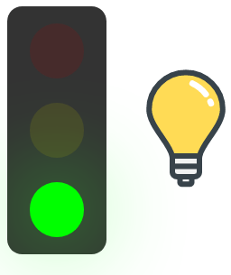
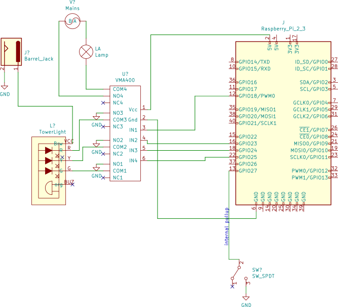

  <a href="" rel="noopener">

<h3 align="center">gotobed</h3>

   
  
  
  

---

 A toddler bedtime routine controller (hardware involved)
      

## About

`gotobed` is the software side of a raspberry pi-controlled traffic light in my toddler's room.

### Hardware

The project connects a raspberry pi to a trio of LED lights (red, yellow, green) a-la a stoplight, and a regular mains-powered lamp. it controls these via a 4-channel relay. More details below.

### Software

This *is* the software! It comes in two parts:

- a `go` binary. This serves as an HTTP server on the pi, offering a JSON API for querying and setting the lights and lamp. It also serves the static web control
- a nuxt (vue) single page web app. It is a graphic front-end to the API, to click light bulbs and things, consuming the API.

## Building

### Hardware

**Schematic**

The Pi is powering the 4Ch relay board with it's 5V pin, and controlling each relay input with the GPIO (@ 3.3V). The board itself is using these inputs to drive an optocoupler which then drives an NPN with the relay power in (5V from the pi) I believe in a darlington array to _then_ drive the relay itself. So not much power coming from the GPIO pin. More coming from the 5V pin.

The tower light is connected to 12V power supply. Each NO pin of the relay is connected to 1 light wire, and the 12V ground (ground the light wire to turn on). There is a buzzer I am not using in this tower light. Could be your 4th channel if you want.

Instead, I am using the 4th channel to control a desk reading lamp. 

**Parts**

- Adafruit [Tower Light](https://www.adafruit.com/product/2993) (and [power supply](https://www.adafruit.com/product/352)) (or any similar tower light, or wires to be switched on/off)
- a 4-channel relay (here is [the one I used](https://www.microcenter.com/product/476352/4-channel-relay-module)).
- a raspberry pi (I use a pi zero w)

For more permanent installation, I put these things in a standard project box, with connectors like [DC barrel jacks](https://www.amazon.com/dp/B073LF3FQK) for the 12V in, [IEC C14](https://www.amazon.com/s?k=c14+mount&ref=nb_sb_noss_2) for mains in, a [panel mounted plug](https://www.amazon.com/s?k=us+plug+panel+mount&ref=nb_sb_noss_2) for lamp control, etc.

### Software

**tl;dr** run `make`

to compile the `go` binary, you can run `go build` (this is automated if you run `make`). Or you can cross-compile with `CGO_ENABLED=0 GOOS=linux GOARCH=arm GOARM=6 go build` (this is automated for you if you run `make pi`).

to compile the web app, `cd` into the `web/` directory. You may need to run `npm install` the first time here. Then `npm run generate` builds the distributable assets into `web/dist`. You can then tar these up with `tar -czvf web.tar.gz web/dist` from the project root. Of course, this is all automated for you, if you just run `make`  (or `make pi`).

## License

MIT License (c) 2019 Dan Panzarella
